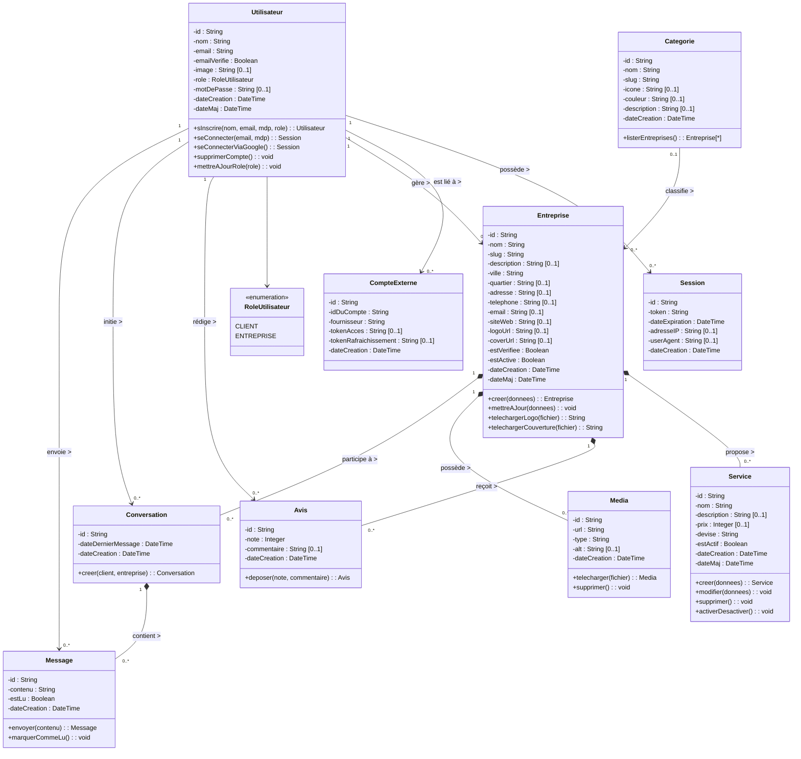

# Diagrammes UML — BizConnect Cameroun

> **Niveau** : Licence 2 — Génie Logiciel  
> **Notation** : UML 2.0 (conventions Laurent Audibert)  
> **Projet** : Plateforme de mise en relation entreprises/clients

---

## 1. Diagramme de Cas d'Utilisation

Le diagramme de cas d'utilisation décrit les **fonctionnalités observables** du système du point de vue de ses acteurs. On y distingue deux acteurs principaux et un acteur secondaire (le système d'authentification).

### 1.1 Identification des acteurs

| Acteur | Type | Description |
|--------|------|-------------|
| **Visiteur** | Principal | Utilisateur non authentifié naviguant sur la plateforme |
| **Client** | Principal | Utilisateur authentifié avec le rôle `client` |
| **Entreprise** | Principal | Utilisateur authentifié avec le rôle `entreprise` |
| **Système Auth** | Secondaire | Système d'authentification externe (Google OAuth, Better-Auth) |

### 1.2 Diagramme

```mermaid
graph TB
    subgraph Système["Système BizConnect Cameroun"]
        direction TB

        UC1["Consulter l'annuaire<br/>des entreprises"]
        UC2["Rechercher une<br/>entreprise"]
        UC3["Consulter le profil<br/>d'une entreprise"]

        UC4["S'inscrire"]
        UC5["S'authentifier"]
        UC5a["S'authentifier<br/>par email/mot de passe"]
        UC5b["S'authentifier<br/>via Google OAuth"]
        UC6["Choisir son rôle"]

        UC7["Déposer un avis"]
        UC8["Envoyer un message<br/>à une entreprise"]

        UC9["Gérer le profil<br/>de l'entreprise"]
        UC9a["Télécharger un logo"]
        UC9b["Télécharger une<br/>image de couverture"]
        UC10["Gérer les services"]
        UC10a["Ajouter un service"]
        UC10b["Modifier un service"]
        UC10c["Supprimer un service"]
        UC10d["Activer/Désactiver<br/>un service"]
        UC11["Consulter le<br/>tableau de bord"]
        UC12["Consulter les avis<br/>reçus"]

        UC13["Supprimer son compte"]
    end

    Visiteur((" Visiteur"))
    Client((" Client"))
    Entreprise((" Entreprise"))
    Google((" Système Auth<br/>Google"))

    %% Visiteur
    Visiteur --> UC1
    Visiteur --> UC2
    Visiteur --> UC3
    Visiteur --> UC4
    Visiteur --> UC5

    %% Généralisation Authentification
    UC5 --- UC5a
    UC5 --- UC5b

    %% Client hérite du Visiteur
    Client --> UC7
    Client --> UC8
    Client --> UC13
    Client --> UC1
    Client --> UC2
    Client --> UC3

    %% Entreprise
    Entreprise --> UC9
    Entreprise --> UC10
    Entreprise --> UC11
    Entreprise --> UC12
    Entreprise --> UC13

    %% Inclusions
    UC4 -. "«include»" .-> UC6
    UC5b -. "«include»" .-> UC6
    UC9 -. "«extend»" .-> UC9a
    UC9 -. "«extend»" .-> UC9b
    UC10 -. "«include»" .-> UC10a
    UC10 -. "«extend»" .-> UC10b
    UC10 -. "«extend»" .-> UC10c
    UC10 -. "«extend»" .-> UC10d

    %% Acteur secondaire
    UC5b --> Google
```

### 1.3 Description textuelle des cas d'utilisation principaux

#### CU-01 : S'inscrire

| Élément | Description |
|---------|-------------|
| **Acteur principal** | Visiteur |
| **Précondition** | Le visiteur n'a pas de compte |
| **Scénario nominal** | 1. Le visiteur accède à la page d'inscription. 2. Il saisit son nom, email et mot de passe. 3. Il choisit son rôle (Client ou Entreprise). 4. Le système crée le compte et redirige vers la page appropriée. |
| **Scénario alternatif** | 3a. Le visiteur clique sur "Continuer avec Google". Le système redirige vers Google OAuth, puis vers la page de sélection de rôle. |
| **Postcondition** | Un nouveau compte est créé dans le système avec le rôle choisi. |

#### CU-07 : Déposer un avis

| Élément | Description |
|---------|-------------|
| **Acteur principal** | Client (authentifié) |
| **Précondition** | Le client est connecté et consulte le profil d'une entreprise |
| **Scénario nominal** | 1. Le client attribue une note (1 à 5). 2. Il rédige un commentaire (optionnel). 3. Il valide. 4. Le système enregistre l'avis et met à jour la note moyenne. |
| **Postcondition** | L'avis est visible sur le profil de l'entreprise. |

#### CU-09 : Gérer le profil de l'entreprise

| Élément | Description |
|---------|-------------|
| **Acteur principal** | Entreprise (authentifié) |
| **Précondition** | L'entreprise est connectée à son tableau de bord |
| **Scénario nominal** | 1. L'entreprise accède à la page "Profil". 2. Elle remplit/modifie les champs (nom, description, catégorie, ville, contact). 3. Elle peut télécharger un logo et/ou une image de couverture (extension). 4. Elle clique "Enregistrer". 5. Le système upload les images vers Vercel Blob, enregistre les URLs en base. |
| **Postcondition** | Le profil est mis à jour et visible publiquement. |

#### CU-13 : Supprimer son compte

| Élément | Description |
|---------|-------------|
| **Acteur principal** | Client ou Entreprise (authentifié) |
| **Précondition** | L'utilisateur est connecté |
| **Scénario nominal** | 1. L'utilisateur accède aux "Paramètres". 2. Il clique "Supprimer mon compte". 3. Le système affiche un dialogue de confirmation. 4. L'utilisateur tape "SUPPRIMER" pour confirmer. 5. Le système supprime le compte et toutes les données associées (cascade SQL). |
| **Postcondition** | Le compte et toutes les données liées sont définitivement supprimés. |

---

## 2. Diagramme de Classes

Le diagramme de classes modélise la **structure statique** du système. Il représente les entités métier, leurs attributs, leurs opérations et les associations qui les relient.

### 2.1 Conventions utilisées

- Les **types** sont notés après `:` (convention UML standard)
- La **visibilité** est indiquée par : `+` (public), `-` (privé), `#` (protégé)
- Les **multiplicités** sont notées sur chaque extrémité d'association
- Les **compositions** (losange plein ◆) indiquent qu'un objet ne peut exister sans son conteneur
- Les **agrégations** (losange vide ◇) indiquent un lien fort sans dépendance existentielle
- Le stéréotype `«enumeration»` est utilisé pour les types énumérés

### 2.2 Diagramme

### 2.3 Dictionnaire des classes

| Classe | Description | Cardinalité clé |
|--------|-------------|----------------|
| **Utilisateur** | Représente tout compte inscrit (client ou entreprise). C'est la classe centrale du système d'authentification. | Un utilisateur peut gérer **0 ou 1** entreprise. |
| **Session** | Matérialise une session d'authentification active (cookie HTTP-Only). | Un utilisateur possède **0 à N** sessions actives. |
| **CompteExterne** | Lien entre un utilisateur et un fournisseur OAuth (Google). | Un utilisateur peut avoir **0 à N** comptes externes. |
| **Catégorie** | Secteur d'activité regroupant les entreprises (Construction, Transport, Santé...). | Une catégorie contient **0 à N** entreprises. |
| **Entreprise** | Entité centrale du métier. Représente un prestataire de services référencé. | Une entreprise propose **0 à N** services, reçoit **0 à N** avis. |
| **Service** | Prestation offerte par une entreprise avec un prix indicatif en XAF. | Composition forte : un service n'existe pas sans son entreprise. |
| **Avis** | Évaluation laissée par un client sur une entreprise (note 1-5 + commentaire). | Association ternaire implicite : un client évalue une entreprise. |
| **Conversation** | Canal de communication entre un client et une entreprise. | Composition forte : contient **0 à N** messages. |
| **Message** | Unité de communication au sein d'une conversation. | Composition forte : un message n'existe pas sans sa conversation. |
| **Media** | Fichier multimédia (image, document) associé à une entreprise. | Composition forte : un média n'existe pas sans son entreprise. |

### 2.4 Relations et multiplicités détaillées

| Association | Multiplicité | Type | Justification |
|-------------|-------------|------|---------------|
| Utilisateur → Session | 1..* ← 1 | Association simple | Un utilisateur peut avoir plusieurs sessions (multi-appareils). La suppression du compte entraîne la suppression des sessions (CASCADE). |
| Utilisateur → CompteExterne | 0..* ← 1 | Association simple | Lien OAuth. Un utilisateur peut ne pas avoir de compte externe (inscription classique). |
| Utilisateur → Entreprise | 0..1 ← 1 | Association simple | Un utilisateur de rôle `ENTREPRISE` gère exactement **une** entreprise. Un `CLIENT` en gère **zéro**. |
| Catégorie → Entreprise | 0..* ← 0..1 | Agrégation | Une entreprise peut ne pas avoir de catégorie. Une catégorie regroupe plusieurs entreprises. |
| Entreprise → Service | 0..* ← 1 | **Composition** ◆ | Un service n'a pas de sens sans son entreprise (suppression en cascade). |
| Entreprise → Avis | 0..* ← 1 | **Composition** ◆ | Un avis est lié à une seule entreprise (suppression en cascade). |
| Entreprise → Media | 0..* ← 1 | **Composition** ◆ | Un média appartient à une seule entreprise. |
| Entreprise → Conversation | 0..* ← 1 | **Composition** ◆ | La suppression de l'entreprise supprime les conversations. |
| Conversation → Message | 0..* ← 1 | **Composition** ◆ | Un message n'existe pas en dehors de sa conversation. |
| Utilisateur → Avis | 0..* ← 1 | Association simple | Un client peut déposer plusieurs avis (sur des entreprises différentes). |
| Utilisateur → Message | 0..* ← 1 | Association simple | Un utilisateur (client ou entreprise) peut envoyer plusieurs messages. |

---

## 3. Notes méthodologiques (pour le rapport)

### Pourquoi ces choix de modélisation ?

1. **Héritage vs. Rôle** : Plutôt qu'un héritage `Client` / `Entreprise` qui hérite d'`Utilisateur`, nous avons utilisé un **attribut `role`** de type énumération. Ce choix est justifié car la structure des deux "types" d'utilisateurs est identique dans la base — seuls les droits d'accès diffèrent (approche par rôle, recommandée par Audibert pour les cas où les sous-classes n'ajoutent pas d'attributs spécifiques).

2. **Composition (◆) vs. Association simple** : Les relations `Entreprise → Service`, `Entreprise → Avis`, `Conversation → Message` sont des **compositions** car l'objet composant (Service, Avis, Message) ne peut pas exister indépendamment de son conteneur. Cela se traduit en SQL par `ON DELETE CASCADE`.

3. **Multiplicités** : Elles sont rigoureusement issues du schéma SQL :
   - `NOT NULL` + `REFERENCES` → multiplicité `1` côté référencé
   - Clé étrangère nullable → multiplicité `0..1`
   - Relation one-to-many → `0..*` ou `1..*`

4. **Stéréotypes** : Le `«include»` est utilisé pour les cas d'utilisation obligatoirement exécutés (ex: choisir son rôle fait partie intégrante de l'inscription). Le `«extend»` est utilisé pour les cas optionnels (ex: télécharger un logo lors de la gestion du profil).
